# nysflag-colormaps

This repository contains 32 colormaps for scientific plots.
All colors come from one source diagram of the New York state flag's 109-color palette, seen on Reddit: https://www.reddit.com/r/vexillology/s/EvCHEmZh6S.

The pack has three types of colormaps:

- 16 qualitative colormaps for categorical data.
- 8 sequential colormaps for ordered data.
- 8 diverging colormaps for data with a center value.

Sequential colormaps have equal steps of lightness (L*).
Diverging colormaps have a neutral center color.
One Python module registers all colormaps in matplotlib.


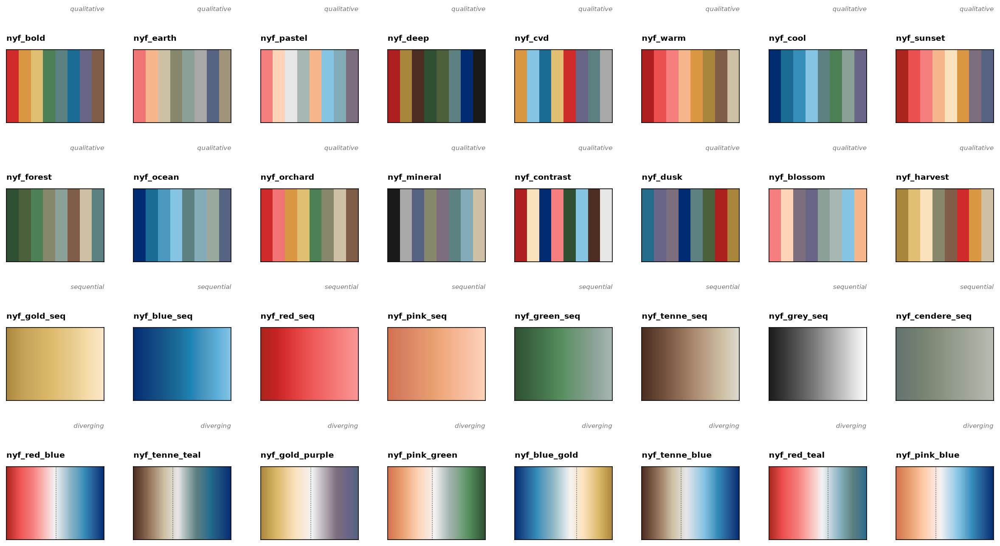


## Repository contents

| Path | Content |
| --- | --- |
| `nysflag_colormaps.py` | Python module. It registers all colormaps in matplotlib. |
| `data/palettes.json` | All colormaps in JSON format, with metadata. |
| `data/csv/` | One CSV file for each colormap. |
| `images/` | One figure for each colormap. |
| `scripts/build_assets.py` | Script. It builds the data files, the figures and this README. |

## Use with matplotlib

The module needs Python 3 and matplotlib. It does not need numpy.

1. Put `nysflag_colormaps.py` in your Python path.
2. Register the colormaps:

```python
import nysflag_colormaps as nyc
nyc.register_all()
```

3. Use a colormap by name:

```python
import matplotlib.pyplot as plt
plt.pcolormesh(x, y, z, cmap="nyf_gold_seq")
```

## Raw data files

Each colormap has a CSV file in `data/csv/`.
Each row has one color of the colormap.
The columns are: index, hex, red, green, blue, lightness.
For sequential and diverging colormaps, the rows are the stop colors.
`data/palettes.json` also has the 256-color ramp of each sequential
and diverging colormap.

## Build the assets again

Run this command in the repository root:

```
uv run scripts/build_assets.py
```

The script needs matplotlib and numpy.
It writes the `data/` files, the `images/` files and this README.

## Overview of the colormaps

| Name | Type | Colors | Use |
| --- | --- | --- | --- |
| nyf_bold | qualitative | 8 | categorical data |
| nyf_earth | qualitative | 8 | categorical data |
| nyf_pastel | qualitative | 8 | categorical data |
| nyf_deep | qualitative | 8 | categorical data |
| nyf_cvd | qualitative | 8 | categorical data |
| nyf_warm | qualitative | 8 | categorical data |
| nyf_cool | qualitative | 8 | categorical data |
| nyf_sunset | qualitative | 8 | categorical data |
| nyf_forest | qualitative | 8 | categorical data |
| nyf_ocean | qualitative | 8 | categorical data |
| nyf_orchard | qualitative | 8 | categorical data |
| nyf_mineral | qualitative | 8 | categorical data |
| nyf_contrast | qualitative | 8 | categorical data |
| nyf_dusk | qualitative | 8 | categorical data |
| nyf_blossom | qualitative | 8 | categorical data |
| nyf_harvest | qualitative | 8 | categorical data |
| nyf_gold_seq | sequential | 8 | ordered data |
| nyf_blue_seq | sequential | 8 | ordered data |
| nyf_red_seq | sequential | 8 | ordered data |
| nyf_pink_seq | sequential | 8 | ordered data |
| nyf_green_seq | sequential | 8 | ordered data |
| nyf_tenne_seq | sequential | 8 | ordered data |
| nyf_grey_seq | sequential | 8 | ordered data |
| nyf_cendere_seq | sequential | 8 | ordered data |
| nyf_red_blue | diverging | 7 | data with a center value |
| nyf_tenne_teal | diverging | 7 | data with a center value |
| nyf_gold_purple | diverging | 7 | data with a center value |
| nyf_pink_green | diverging | 7 | data with a center value |
| nyf_blue_gold | diverging | 7 | data with a center value |
| nyf_tenne_blue | diverging | 7 | data with a center value |
| nyf_red_teal | diverging | 7 | data with a center value |
| nyf_pink_blue | diverging | 7 | data with a center value |

## The colormaps

### nyf_bold

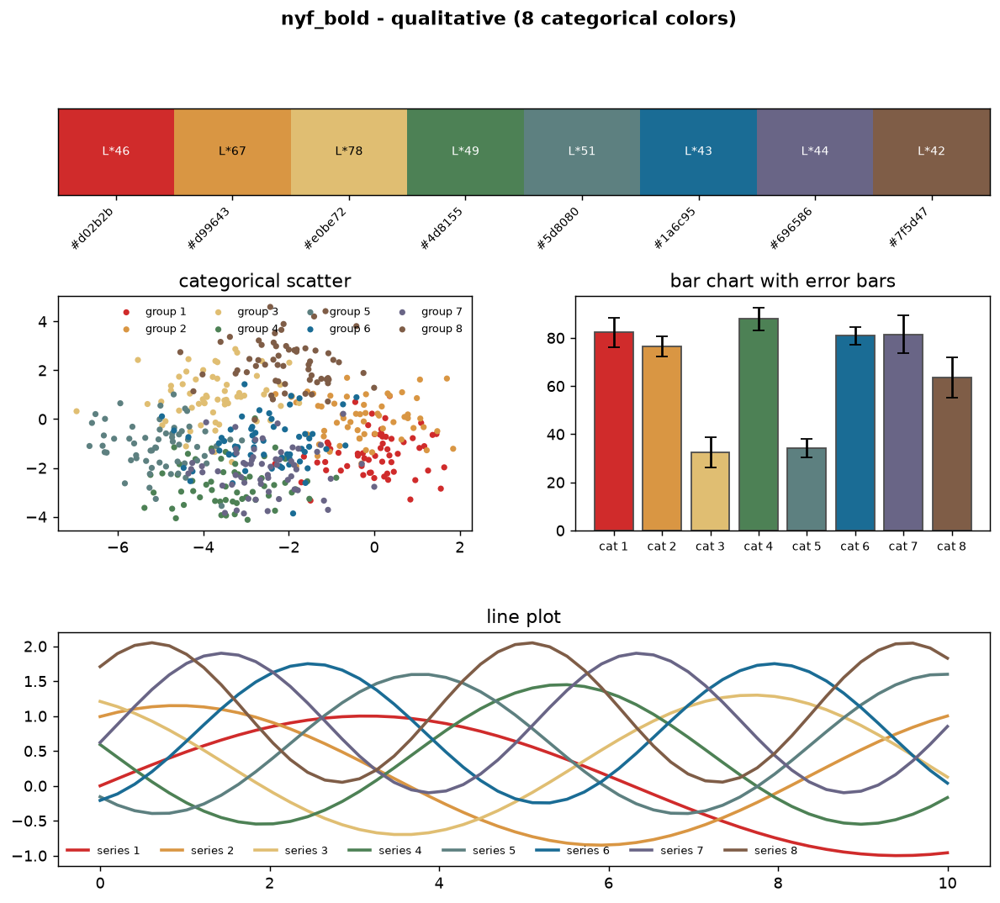

| Property | Value |
| --- | --- |
| Type | qualitative |
| Number of colors | 8 |
| Source families | Bedsheet, Gold, Green, Purple, Reds, Teal, Tenne |
| Minimum color difference (dE) | 21.0 |
| Lightness range (L*) | 42.5 to 78.4 |

Hex values: `#d02b2b` `#d99643` `#e0be72` `#4d8155` `#5d8080` `#1a6c95` `#696586` `#7f5d47`

Use it for categorical data.

### nyf_earth

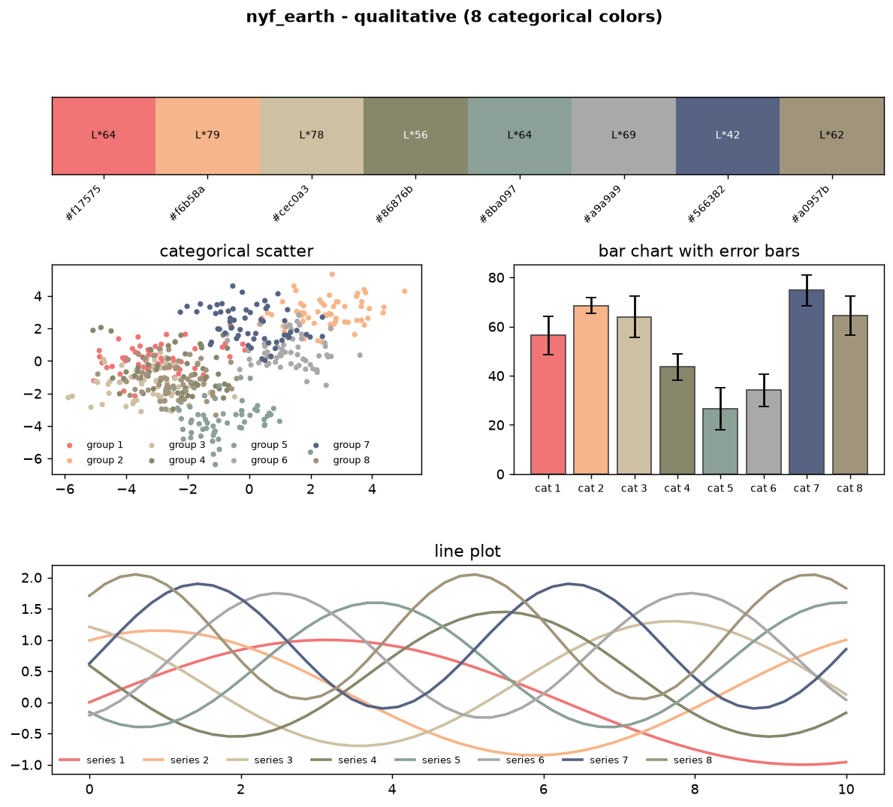

| Property | Value |
| --- | --- |
| Type | qualitative |
| Number of colors | 8 |
| Source families | Green, Grey, Pink, Purple, Reds, Tenne |
| Minimum color difference (dE) | 8.2 |
| Lightness range (L*) | 42.0 to 78.7 |

Hex values: `#f17575` `#f6b58a` `#cec0a3` `#86876b` `#8ba097` `#a9a9a9` `#566382` `#a0957b`

Use it for categorical data.

### nyf_pastel

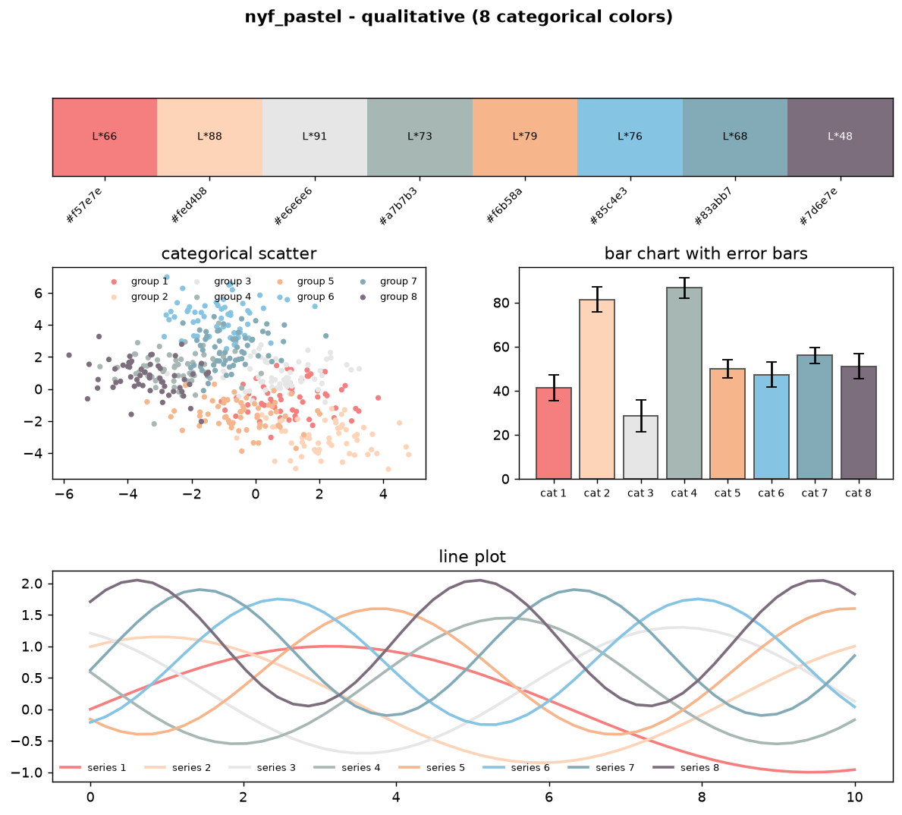

| Property | Value |
| --- | --- |
| Type | qualitative |
| Number of colors | 8 |
| Source families | Bedsheet, Green, Grey, Pink, Purple, Reds |
| Minimum color difference (dE) | 12.8 |
| Lightness range (L*) | 48.3 to 91.3 |

Hex values: `#f57e7e` `#fed4b8` `#e6e6e6` `#a7b7b3` `#f6b58a` `#85c4e3` `#83abb7` `#7d6e7e`

Use it for categorical data.

### nyf_deep

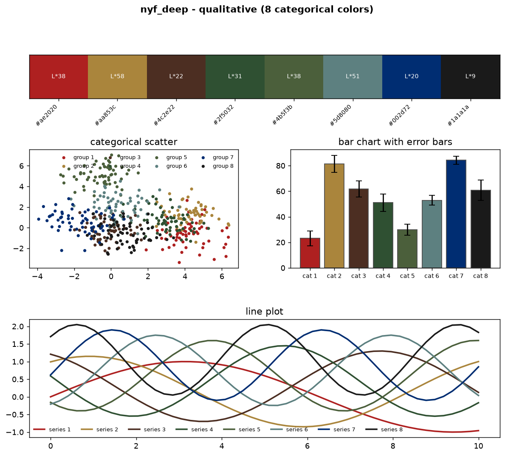

| Property | Value |
| --- | --- |
| Type | qualitative |
| Number of colors | 8 |
| Source families | Bedsheet, Gold, Green, Grey, Reds, Teal, Tenne |
| Minimum color difference (dE) | 9.3 |
| Lightness range (L*) | 9.3 to 57.7 |

Hex values: `#ae2020` `#aa853c` `#4c2e22` `#2f5032` `#4b5f3b` `#5d8080` `#002d72` `#1a1a1a`

Use it for categorical data.

### nyf_cvd

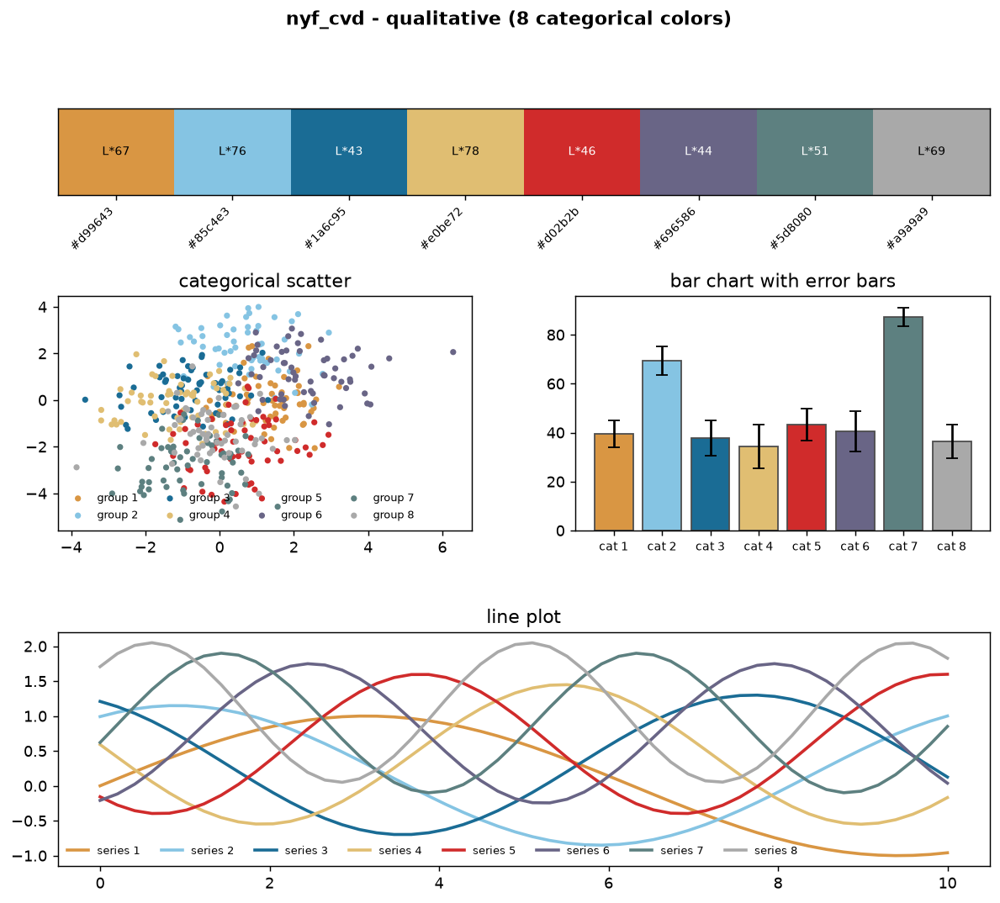

| Property | Value |
| --- | --- |
| Type | qualitative |
| Number of colors | 8 |
| Source families | Bedsheet, Gold, Grey, Purple, Reds, Teal |
| Minimum color difference (dE) | 21.0 |
| Lightness range (L*) | 42.9 to 78.4 |

Hex values: `#d99643` `#85c4e3` `#1a6c95` `#e0be72` `#d02b2b` `#696586` `#5d8080` `#a9a9a9`

Use it for categorical data.

### nyf_warm

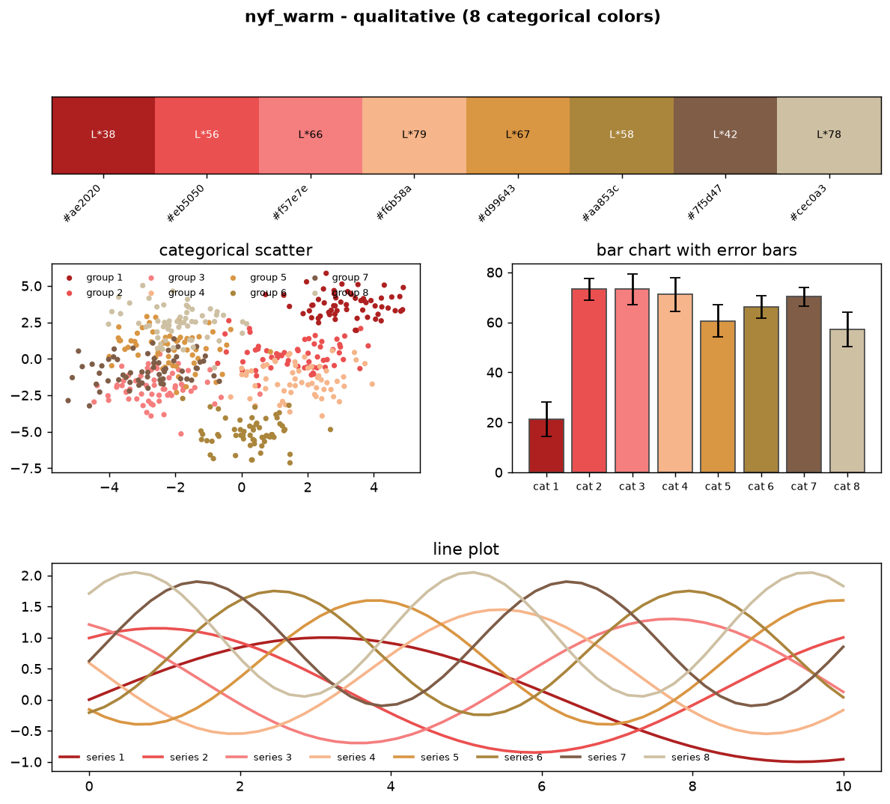

| Property | Value |
| --- | --- |
| Type | qualitative |
| Number of colors | 8 |
| Source families | Gold, Pink, Reds, Tenne |
| Minimum color difference (dE) | 17.3 |
| Lightness range (L*) | 38.1 to 78.7 |

Hex values: `#ae2020` `#eb5050` `#f57e7e` `#f6b58a` `#d99643` `#aa853c` `#7f5d47` `#cec0a3`

Use it for categorical data.

### nyf_cool

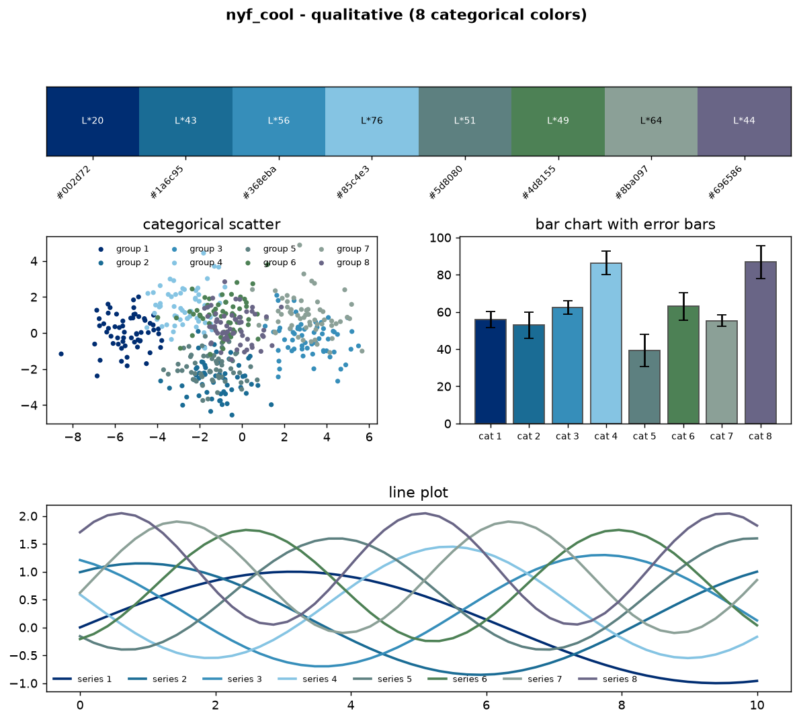

| Property | Value |
| --- | --- |
| Type | qualitative |
| Number of colors | 8 |
| Source families | Bedsheet, Green, Purple, Teal |
| Minimum color difference (dE) | 13.2 |
| Lightness range (L*) | 20.4 to 76.1 |

Hex values: `#002d72` `#1a6c95` `#368eba` `#85c4e3` `#5d8080` `#4d8155` `#8ba097` `#696586`

Use it for categorical data.

### nyf_sunset

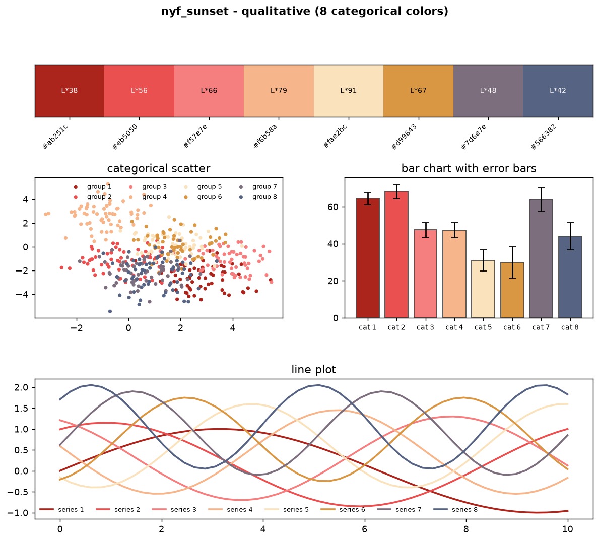

| Property | Value |
| --- | --- |
| Type | qualitative |
| Number of colors | 8 |
| Source families | Gold, Pink, Purple, Reds |
| Minimum color difference (dE) | 15.0 |
| Lightness range (L*) | 38.0 to 90.9 |

Hex values: `#ab251c` `#eb5050` `#f57e7e` `#f6b58a` `#fae2bc` `#d99643` `#7d6e7e` `#566382`

Use it for categorical data.

### nyf_forest

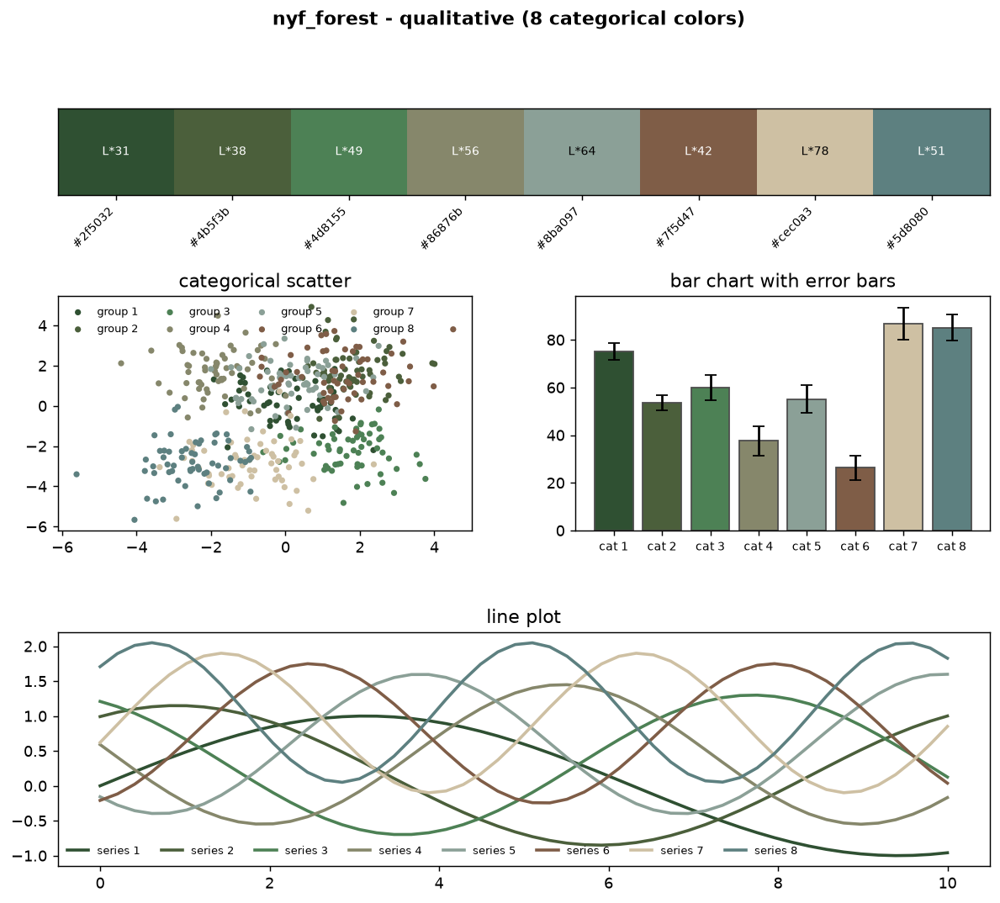

| Property | Value |
| --- | --- |
| Type | qualitative |
| Number of colors | 8 |
| Source families | Green, Teal, Tenne |
| Minimum color difference (dE) | 9.3 |
| Lightness range (L*) | 30.8 to 78.1 |

Hex values: `#2f5032` `#4b5f3b` `#4d8155` `#86876b` `#8ba097` `#7f5d47` `#cec0a3` `#5d8080`

Use it for categorical data.

### nyf_ocean

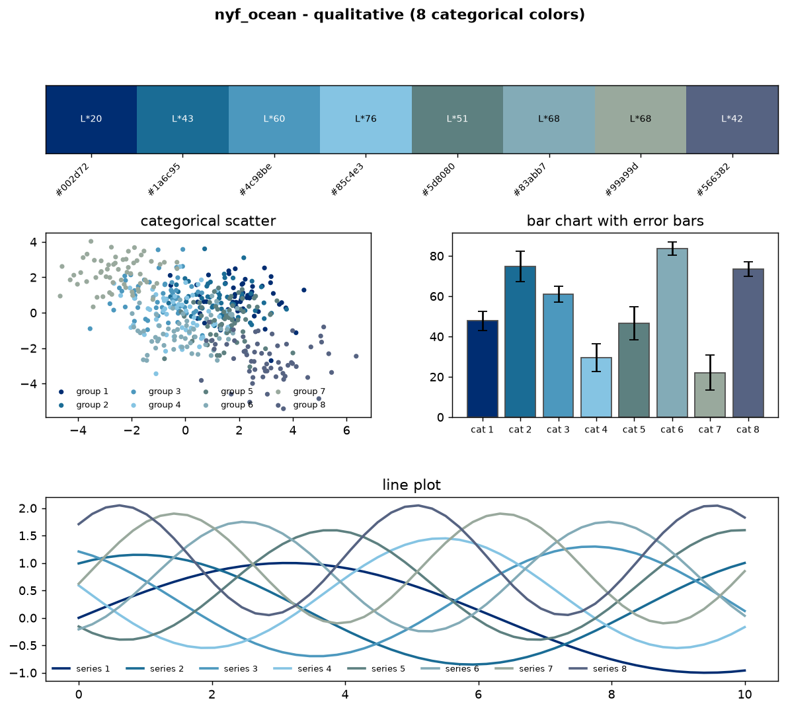

| Property | Value |
| --- | --- |
| Type | qualitative |
| Number of colors | 8 |
| Source families | Bedsheet, Green, Purple, Teal |
| Minimum color difference (dE) | 14.2 |
| Lightness range (L*) | 20.4 to 76.1 |

Hex values: `#002d72` `#1a6c95` `#4c98be` `#85c4e3` `#5d8080` `#83abb7` `#99a99d` `#566382`

Use it for categorical data.

### nyf_orchard

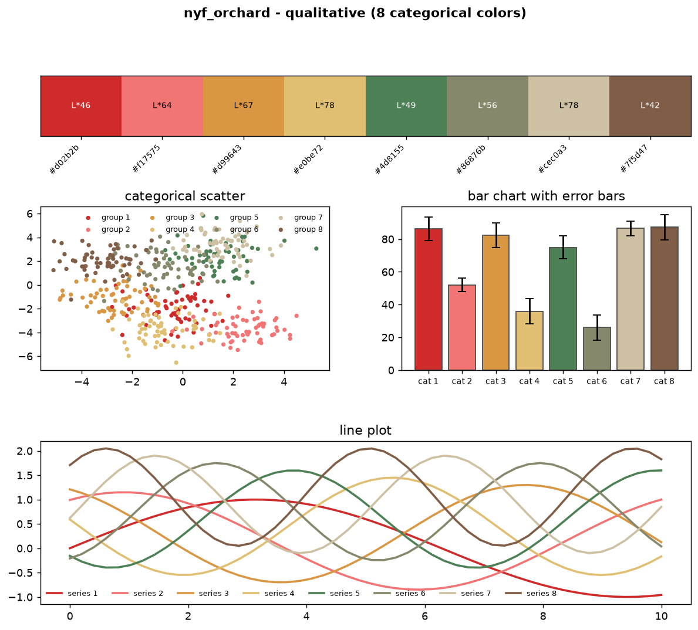

| Property | Value |
| --- | --- |
| Type | qualitative |
| Number of colors | 8 |
| Source families | Gold, Green, Reds, Tenne |
| Minimum color difference (dE) | 21.0 |
| Lightness range (L*) | 42.5 to 78.4 |

Hex values: `#d02b2b` `#f17575` `#d99643` `#e0be72` `#4d8155` `#86876b` `#cec0a3` `#7f5d47`

Use it for categorical data.

### nyf_mineral

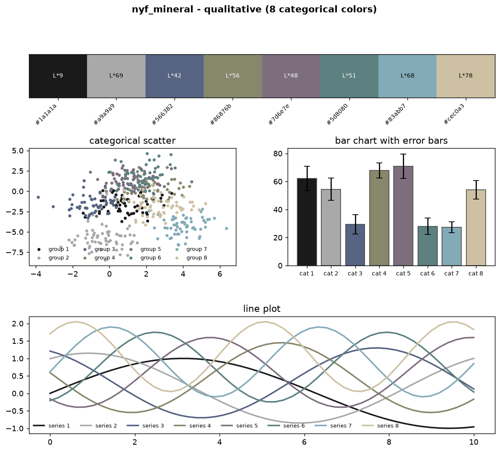

| Property | Value |
| --- | --- |
| Type | qualitative |
| Number of colors | 8 |
| Source families | Bedsheet, Green, Grey, Purple, Teal, Tenne |
| Minimum color difference (dE) | 15.0 |
| Lightness range (L*) | 9.3 to 78.1 |

Hex values: `#1a1a1a` `#a9a9a9` `#566382` `#86876b` `#7d6e7e` `#5d8080` `#83abb7` `#cec0a3`

Use it for categorical data.

### nyf_contrast

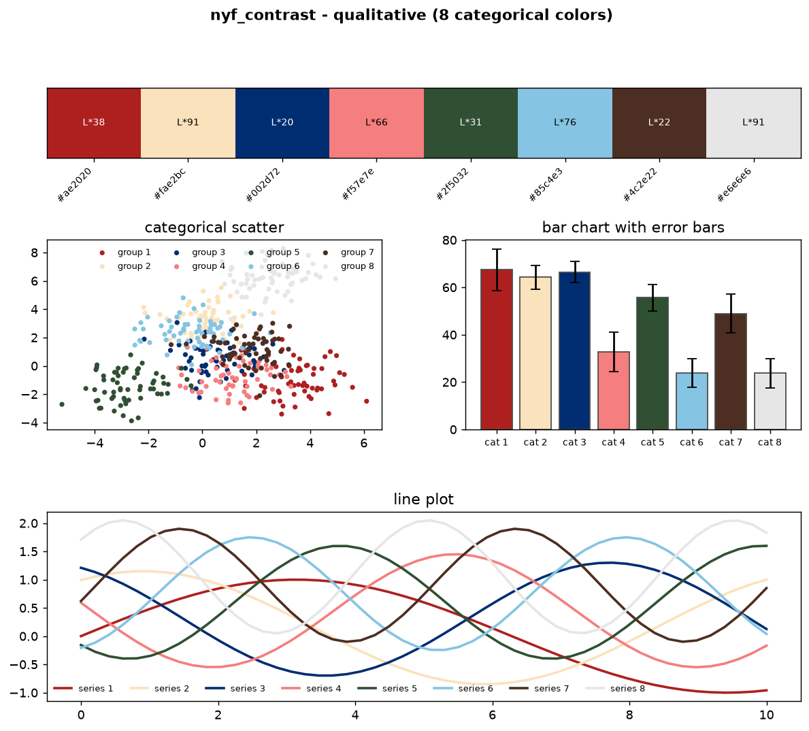

| Property | Value |
| --- | --- |
| Type | qualitative |
| Number of colors | 8 |
| Source families | Bedsheet, Gold, Green, Grey, Reds, Tenne |
| Minimum color difference (dE) | 21.7 |
| Lightness range (L*) | 20.4 to 91.3 |

Hex values: `#ae2020` `#fae2bc` `#002d72` `#f57e7e` `#2f5032` `#85c4e3` `#4c2e22` `#e6e6e6`

Use it for categorical data.

### nyf_dusk

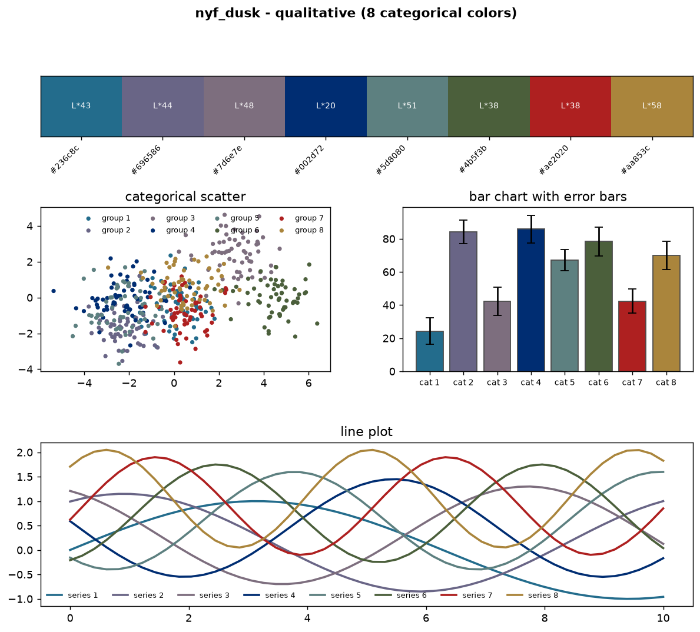

| Property | Value |
| --- | --- |
| Type | qualitative |
| Number of colors | 8 |
| Source families | Bedsheet, Gold, Green, Purple, Reds, Teal |
| Minimum color difference (dE) | 11.7 |
| Lightness range (L*) | 20.4 to 57.7 |

Hex values: `#236c8c` `#696586` `#7d6e7e` `#002d72` `#5d8080` `#4b5f3b` `#ae2020` `#aa853c`

Use it for categorical data.

### nyf_blossom

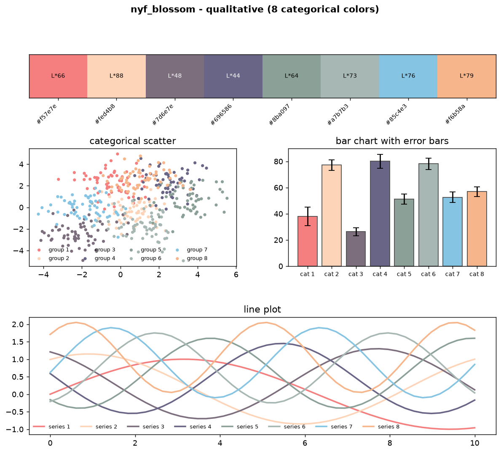

| Property | Value |
| --- | --- |
| Type | qualitative |
| Number of colors | 8 |
| Source families | Bedsheet, Green, Pink, Purple, Reds |
| Minimum color difference (dE) | 9.7 |
| Lightness range (L*) | 44.3 to 87.8 |

Hex values: `#f57e7e` `#fed4b8` `#7d6e7e` `#696586` `#8ba097` `#a7b7b3` `#85c4e3` `#f6b58a`

Use it for categorical data.

### nyf_harvest

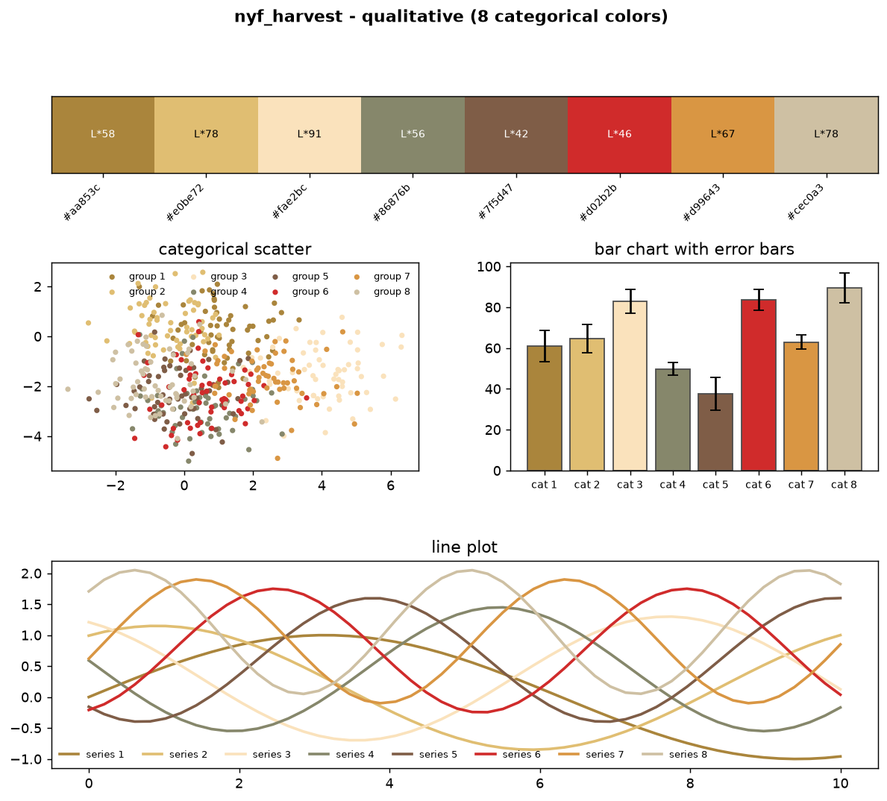

| Property | Value |
| --- | --- |
| Type | qualitative |
| Number of colors | 8 |
| Source families | Gold, Green, Reds, Tenne |
| Minimum color difference (dE) | 14.0 |
| Lightness range (L*) | 42.5 to 90.9 |

Hex values: `#aa853c` `#e0be72` `#fae2bc` `#86876b` `#7f5d47` `#d02b2b` `#d99643` `#cec0a3`

Use it for categorical data.

### nyf_gold_seq

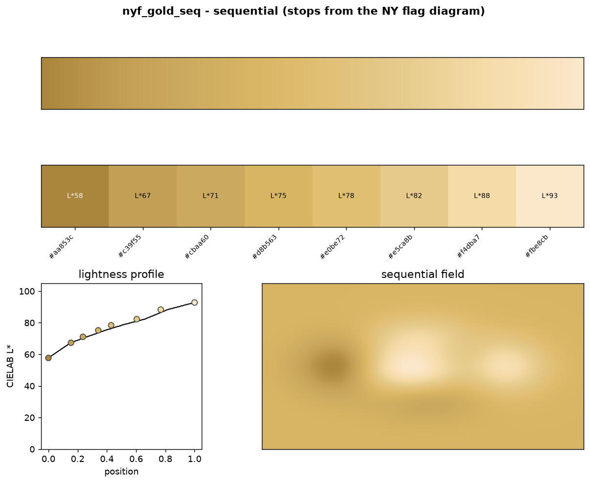

| Property | Value |
| --- | --- |
| Type | sequential |
| Number of colors | 8 |
| Source families | Gold |
| Lightness step (dL*) | 3.2 to 9.6 |
| Lightness range (L*) | 57.7 to 92.8 |

Hex values: `#aa853c` `#c39f55` `#cbaa60` `#d8b563` `#e0be72` `#e5ca8b` `#f4dba7` `#fbe8cb`

Use it for ordered data.

### nyf_blue_seq

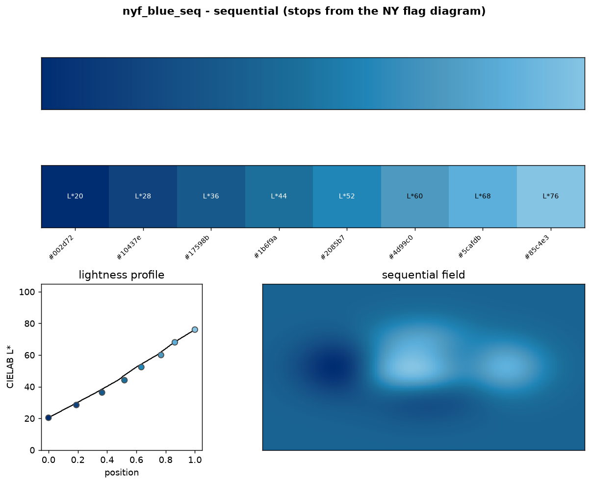

| Property | Value |
| --- | --- |
| Type | sequential |
| Number of colors | 8 |
| Source families | Bedsheet |
| Lightness step (dL*) | 7.6 to 8.3 |
| Lightness range (L*) | 20.4 to 76.1 |

Hex values: `#002d72` `#10437e` `#17598b` `#1b6f9a` `#2085b7` `#4d99c0` `#5cafdb` `#85c4e3`

Use it for ordered data.

### nyf_red_seq

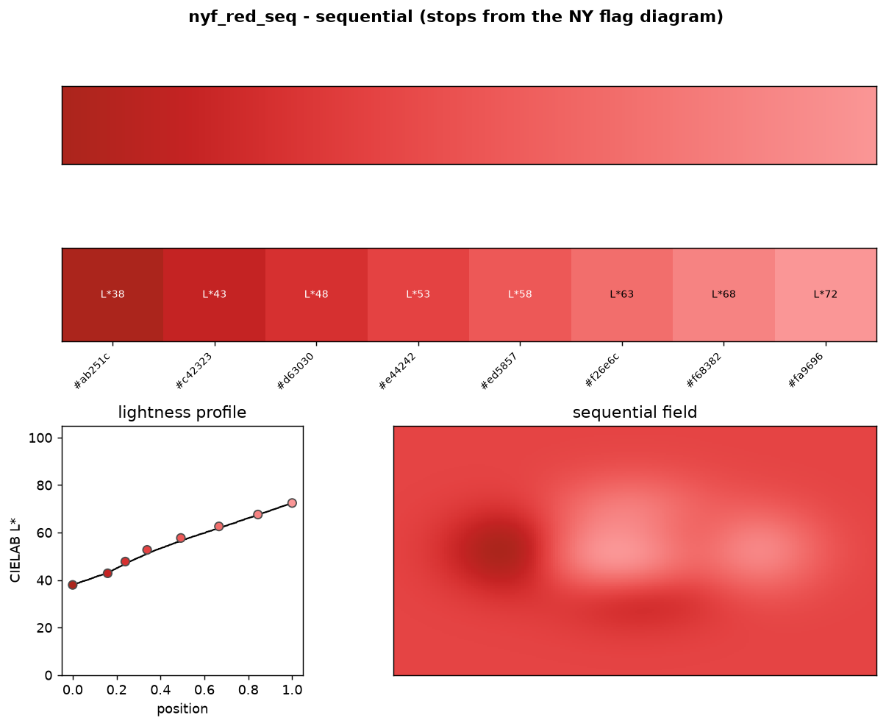

| Property | Value |
| --- | --- |
| Type | sequential |
| Number of colors | 8 |
| Source families | Reds |
| Lightness step (dL*) | 4.9 to 5.0 |
| Lightness range (L*) | 38.0 to 72.5 |

Hex values: `#ab251c` `#c42323` `#d63030` `#e44242` `#ed5857` `#f26e6c` `#f68382` `#fa9696`

Use it for ordered data.

### nyf_pink_seq

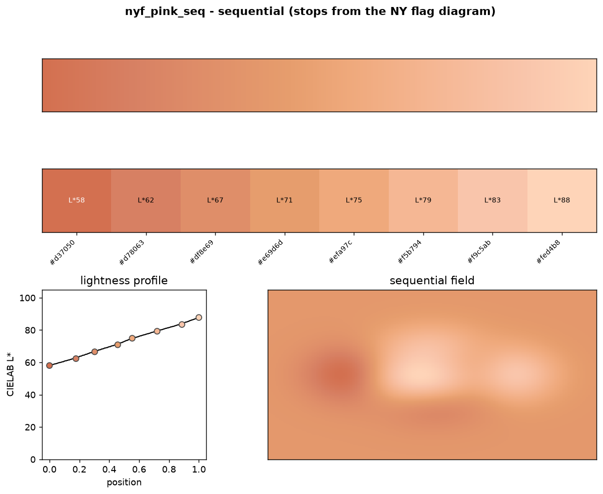

| Property | Value |
| --- | --- |
| Type | sequential |
| Number of colors | 8 |
| Source families | Pink |
| Lightness step (dL*) | 4.0 to 4.4 |
| Lightness range (L*) | 58.1 to 87.8 |

Hex values: `#d37050` `#d78063` `#df8e69` `#e69d6d` `#efa97c` `#f5b794` `#f9c5ab` `#fed4b8`

Use it for ordered data.

### nyf_green_seq

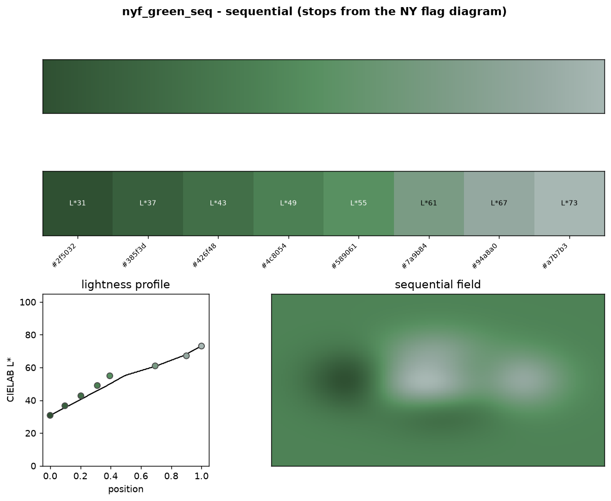

| Property | Value |
| --- | --- |
| Type | sequential |
| Number of colors | 8 |
| Source families | Green |
| Lightness step (dL*) | 5.9 to 6.2 |
| Lightness range (L*) | 30.8 to 73.1 |

Hex values: `#2f5032` `#385f3d` `#426f48` `#4c8054` `#589061` `#7a9b84` `#94a8a0` `#a7b7b3`

Use it for ordered data.

### nyf_tenne_seq

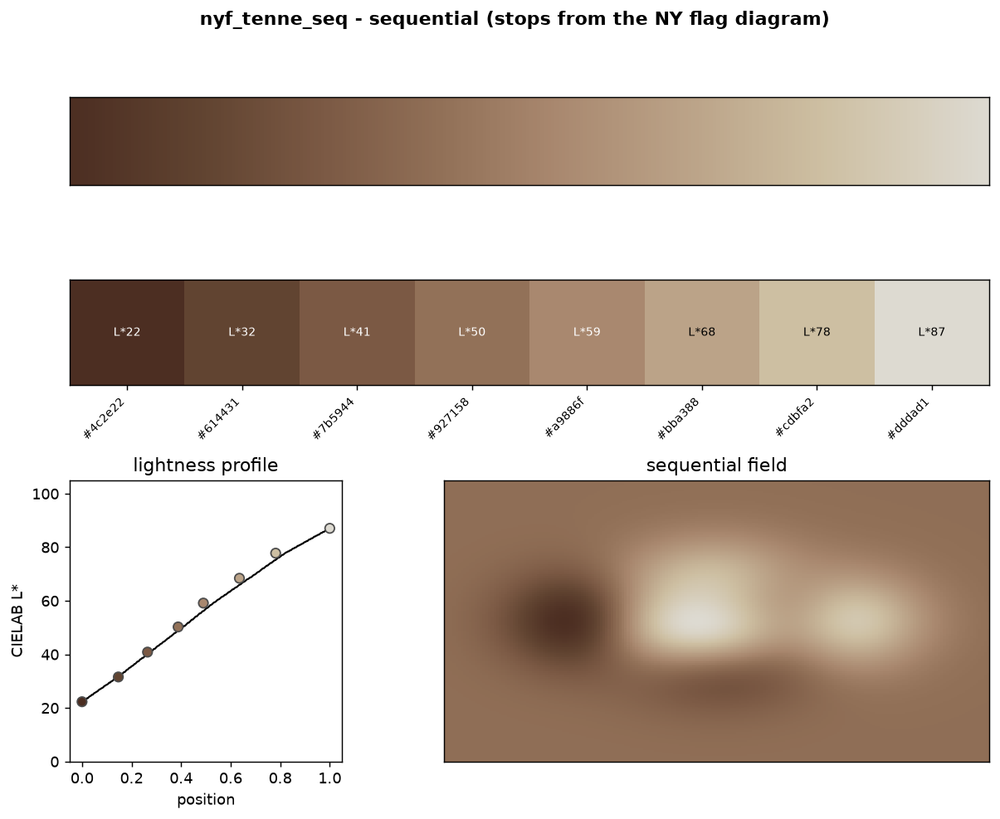

| Property | Value |
| --- | --- |
| Type | sequential |
| Number of colors | 8 |
| Source families | Tenne |
| Lightness step (dL*) | 9.0 to 9.4 |
| Lightness range (L*) | 22.3 to 87.1 |

Hex values: `#4c2e22` `#614431` `#7b5944` `#927158` `#a9886f` `#bba388` `#cdbfa2` `#dddad1`

Use it for ordered data.

### nyf_grey_seq

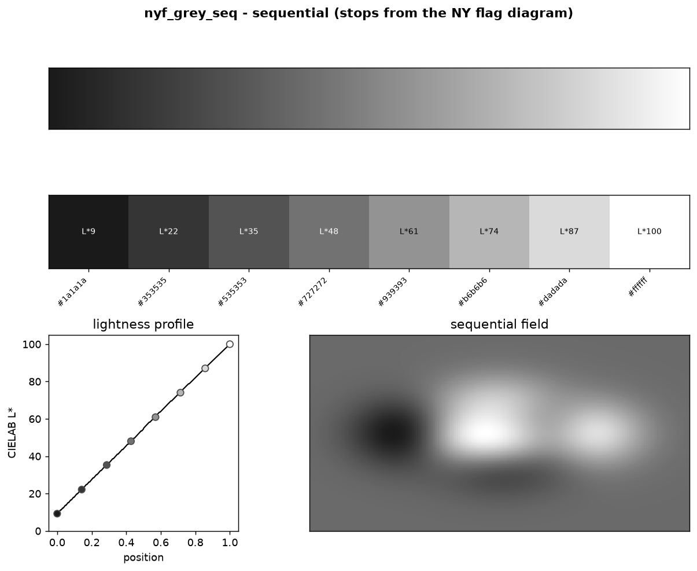

| Property | Value |
| --- | --- |
| Type | sequential |
| Number of colors | 8 |
| Source families | Grey |
| Lightness step (dL*) | 12.7 to 13.1 |
| Lightness range (L*) | 9.3 to 100.0 |

Hex values: `#1a1a1a` `#353535` `#535353` `#727272` `#939393` `#b6b6b6` `#dadada` `#ffffff`

Use it for ordered data.

### nyf_cendere_seq

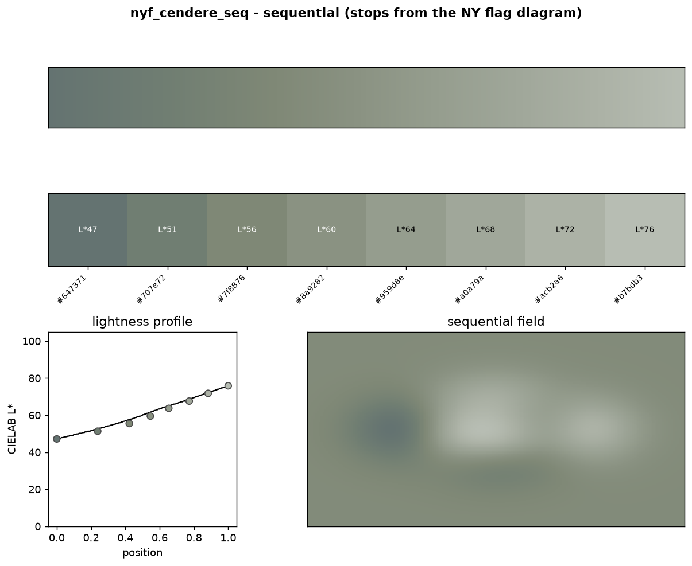

| Property | Value |
| --- | --- |
| Type | sequential |
| Number of colors | 8 |
| Source families | Cendere |
| Lightness step (dL*) | 3.9 to 4.2 |
| Lightness range (L*) | 47.2 to 75.9 |

Hex values: `#647371` `#707e72` `#7f8876` `#8a9282` `#959d8e` `#a0a79a` `#acb2a6` `#b7bdb3`

Use it for ordered data.

### nyf_red_blue

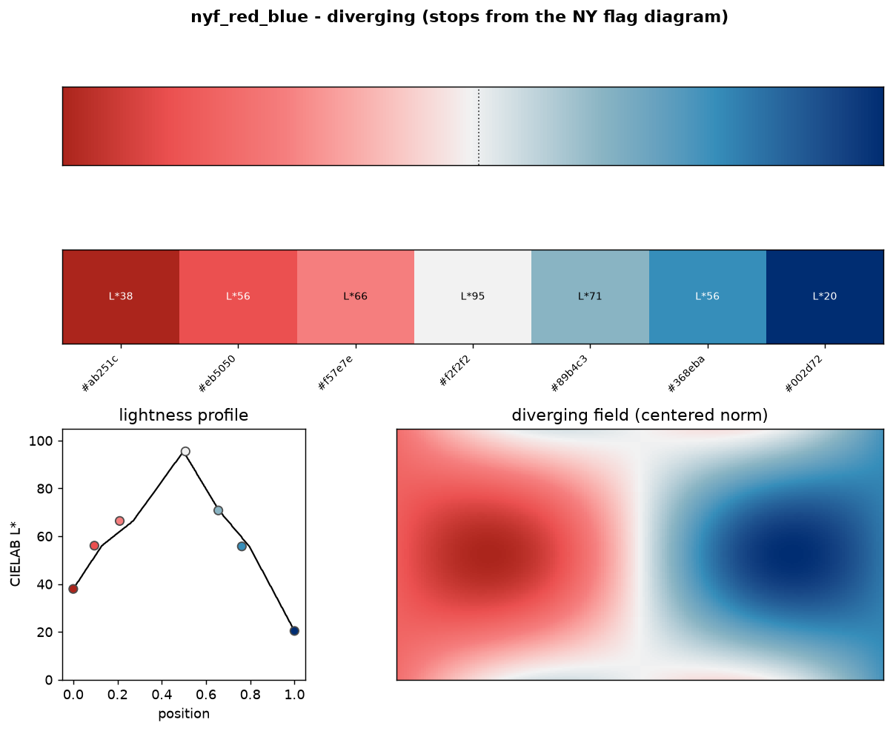

| Property | Value |
| --- | --- |
| Type | diverging |
| Number of colors | 7 |
| Source families | Reds, Bedsheet |
| Lightness range (L*) | 20.4 to 95.5 |

Hex values: `#ab251c` `#eb5050` `#f57e7e` `#f2f2f2` `#89b4c3` `#368eba` `#002d72`

Use it for data with a center value.

### nyf_tenne_teal

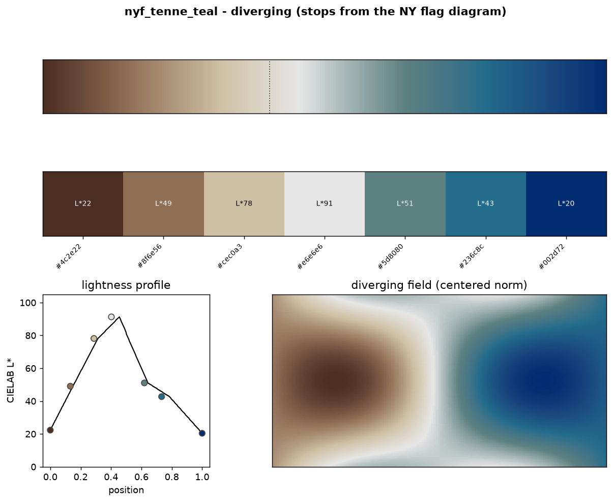

| Property | Value |
| --- | --- |
| Type | diverging |
| Number of colors | 7 |
| Source families | Tenne, Teal, Bedsheet |
| Lightness range (L*) | 20.4 to 91.3 |

Hex values: `#4c2e22` `#8f6e56` `#cec0a3` `#e6e6e6` `#5d8080` `#236c8c` `#002d72`

Use it for data with a center value.

### nyf_gold_purple

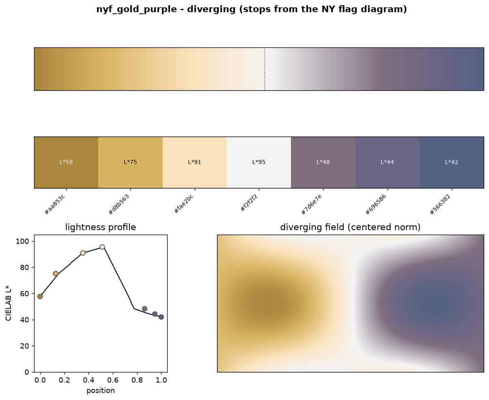

| Property | Value |
| --- | --- |
| Type | diverging |
| Number of colors | 7 |
| Source families | Gold, Purple |
| Lightness range (L*) | 42.0 to 95.5 |

Hex values: `#aa853c` `#d8b563` `#fae2bc` `#f2f2f2` `#7d6e7e` `#696586` `#566382`

Use it for data with a center value.

### nyf_pink_green

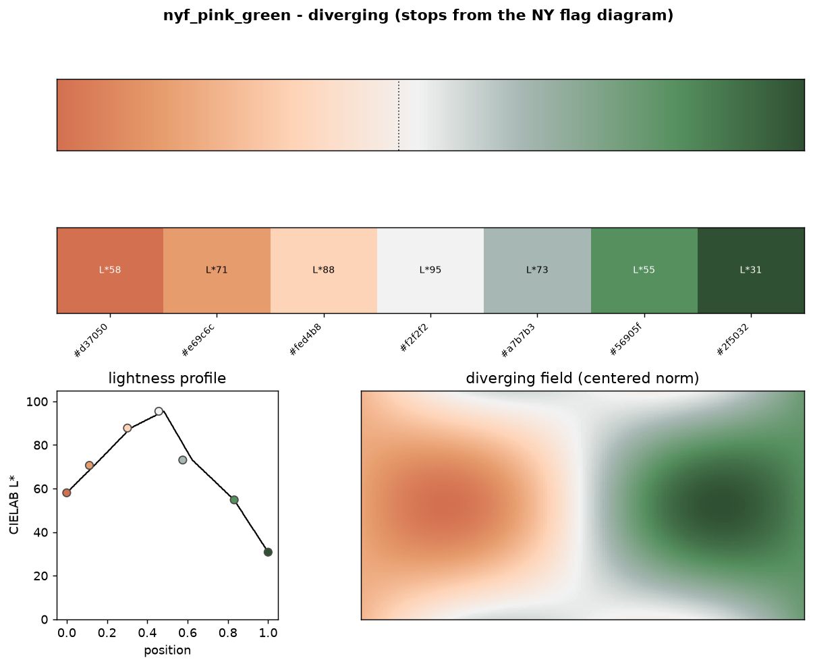

| Property | Value |
| --- | --- |
| Type | diverging |
| Number of colors | 7 |
| Source families | Pink, Green |
| Lightness range (L*) | 30.8 to 95.5 |

Hex values: `#d37050` `#e69c6c` `#fed4b8` `#f2f2f2` `#a7b7b3` `#56905f` `#2f5032`

Use it for data with a center value.

### nyf_blue_gold

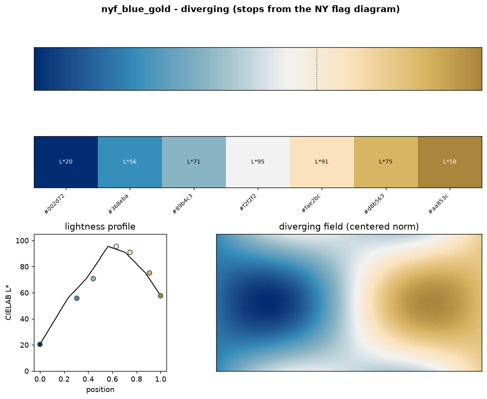

| Property | Value |
| --- | --- |
| Type | diverging |
| Number of colors | 7 |
| Source families | Bedsheet, Gold |
| Lightness range (L*) | 20.4 to 95.5 |

Hex values: `#002d72` `#368eba` `#89b4c3` `#f2f2f2` `#fae2bc` `#d8b563` `#aa853c`

Use it for data with a center value.

### nyf_tenne_blue

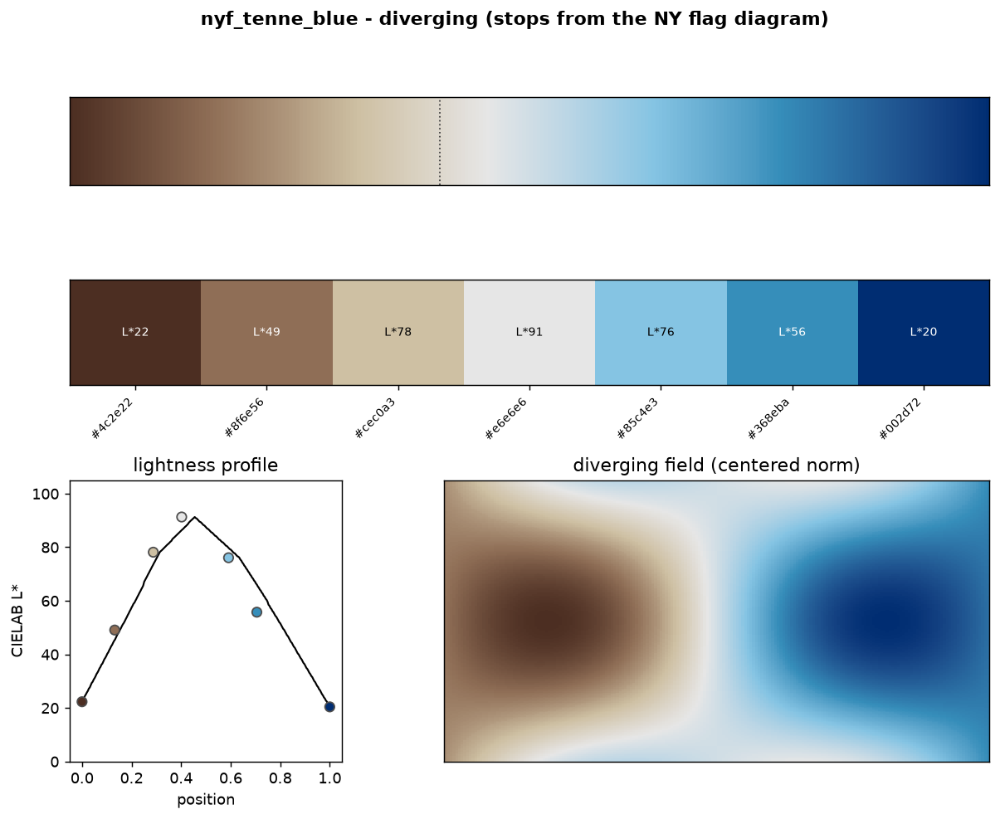

| Property | Value |
| --- | --- |
| Type | diverging |
| Number of colors | 7 |
| Source families | Tenne, Bedsheet |
| Lightness range (L*) | 20.4 to 91.3 |

Hex values: `#4c2e22` `#8f6e56` `#cec0a3` `#e6e6e6` `#85c4e3` `#368eba` `#002d72`

Use it for data with a center value.

### nyf_red_teal

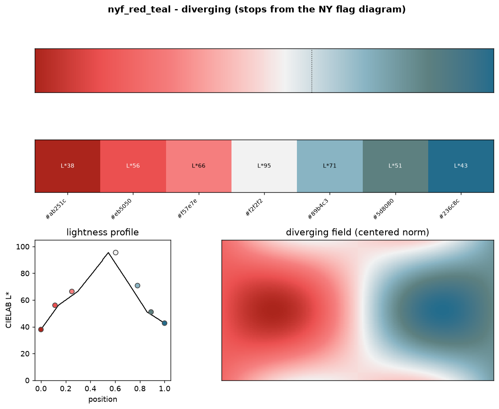

| Property | Value |
| --- | --- |
| Type | diverging |
| Number of colors | 7 |
| Source families | Reds, Teal, Bedsheet |
| Lightness range (L*) | 38.0 to 95.5 |

Hex values: `#ab251c` `#eb5050` `#f57e7e` `#f2f2f2` `#89b4c3` `#5d8080` `#236c8c`

Use it for data with a center value.

### nyf_pink_blue

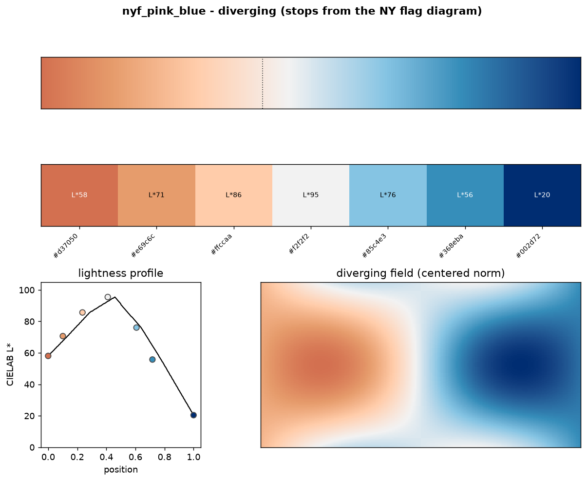

| Property | Value |
| --- | --- |
| Type | diverging |
| Number of colors | 7 |
| Source families | Pink, Bedsheet |
| Lightness range (L*) | 20.4 to 95.5 |

Hex values: `#d37050` `#e69c6c` `#ffccaa` `#f2f2f2` `#85c4e3` `#368eba` `#002d72`

Use it for data with a center value.
